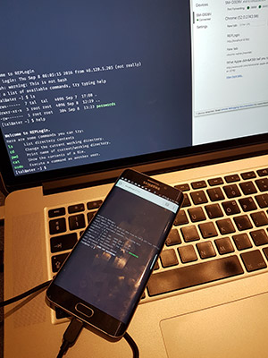

# REPLogin

### A REPL written with React demonstrating user login

> A read–eval–print loop (REPL), also known as an interactive toplevel or language shell, is a simple, interactive computer programming environment that takes single user inputs, evaluates them, and returns the result to the user. Common examples include command line shells...
-- <cite>[read–eval–print loop - Wikipedia](https://en.wikipedia.org/wiki/Read%E2%80%93eval%E2%80%93print_loop)</cite>

### Getting started with REPLogin

- [ ] Clone the project: `$ git clone git@github.com:TalAter/REPLogin.git`
- [ ] Change to REPLogin directory: `cd REPLogin`
- [ ] Install dependencies: `$ npm install`
- [ ] Run REPLogin's server: `$ npm start`
- [ ] Point your browser to `http://localhost:8765/`
- [ ] Play around with some commands **(the password is: `12345`)**

### Some commands to try

- `help` - Shows a list of available commands
- `ls` - List directory contents
- `cat passwords` - Attempt to display the contents of the _passwords_ file
- **`sudo cat passwords` - Login as a super user and display contents of _passwords_ file (passwords is: `12345`)**
 
### tl;dr;

Too busy to download the project and try it yourself? Here is a video of it in action.

